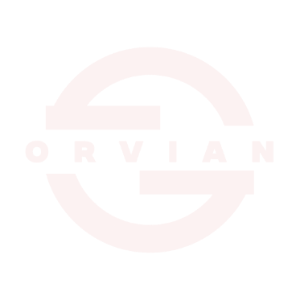
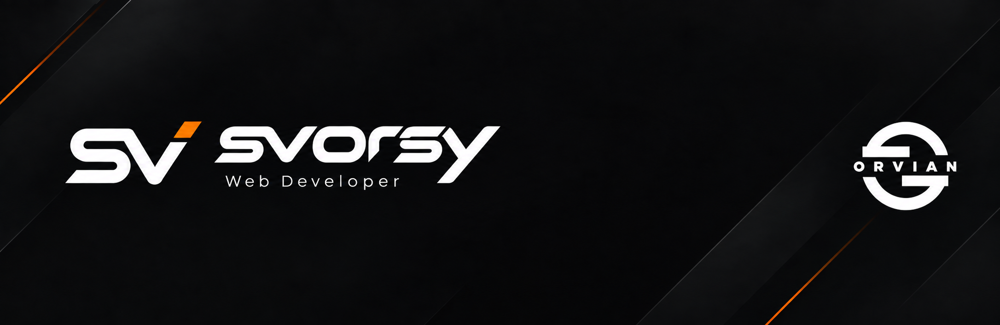

<h1 align="center">Hi, I'm Emirhan 👋</h1>

  Web Developer • Founder of Orvian Development

  

---

<h2 align="center">About Me</h2>

  I'm <b>Emirhan</b>, a developer focused on building modern web applications
  and custom systems.

  I enjoy creating clean, functional and scalable projects while constantly
  improving my development skills.

  💻 Web Development
  &nbsp;&nbsp;•&nbsp;&nbsp;
  ⚙️ Backend Systems
  &nbsp;&nbsp;•&nbsp;&nbsp;
  🛠️ Custom Tools

---

<h2 align="center">Tech Stack</h2>

  

---

<h2 align="center">What I Work With</h2>

<h3 align="center">Web Development</h3>

  HTML • CSS • Tailwind CSS • JavaScript • PHP • MySQL

---

<h2 align="center">Projects</h2>

<h3 align="center">Orvian Development</h3>

  Development projects focused on modern web systems
  and custom software solutions.

  <a href="https://orviandev.com">
    🌐 orviandev.com
  </a>

  

---

<h2 align="center">GitHub Stats</h2>

  

---

<h2 align="center">GitHub Streak</h2>

  

---

<h2 align="center">Current Focus</h2>

  🌐 Modern Web Projects
  &nbsp;&nbsp;•&nbsp;&nbsp;
  ⚙️ Backend Systems
  &nbsp;&nbsp;•&nbsp;&nbsp;
  🔌 API Integrations

  📦 Open Source
  &nbsp;&nbsp;•&nbsp;&nbsp;
  🚀 Orvian Development

---

  <b>Building, learning and improving every day.</b>

 

  

